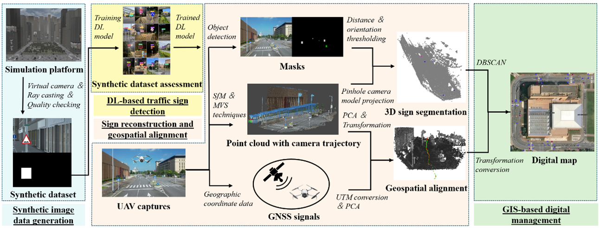
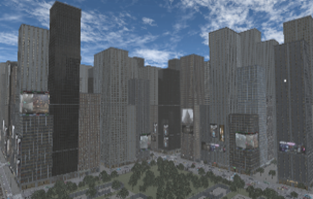
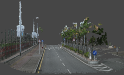

# Generalized traffic sign recognition and localization through synthetic data generation and 3D semantic reconstruction

## Overview
This research proposes a universal approach to automated traffic sign management by developing synthetic data generation and 3D semantic reconstruction techniques. The goal is to create a highly automated and versatile solution for traffic sign inventory management. The workflow is outlined as follows:

1. **Synthetic Data Generation**: A virtual reality platform is prototyped to automatically generate a large-scale dataset of synthetic traffic sign images with precise annotations.
2. **Deep Learning-Based Detection**: Synthetic images are utilized to train deep learning models for traffic sign detection, with studies conducted to optimize recognition performance using synthetic data.
3. **3D Semantic Reconstruction**: Photogrammetry is employed to reconstruct 3D models, integrated with detection masks to generate, classify, and localize traffic signs within a 3D semantic point cloud.
4. **Geospatial Alignment**: Camera trajectories are combined with real-world Global Navigation Satellite System (GNSS) signals to enhance the geospatial accuracy of sign localization.

  
  

    Fig. 1.
    Workflow of the proposed DL and photogrammetry-integrated approach
  

  
## Repository Contents
This repository is intended to house the raw data and code for the proposed methodology, including:
- **Traffic Sign Generation**: Scripts to identify roads in a virtual environment and generate traffic signs according to the defined workflow.
- **Camera Placement and Mask Generation**: Code to position cameras and generate mask images using raycasting.
- **Format Conversion Scripts**: Tools for converting data into compatible formats.
- **3D Semantic Point Cloud Processing**: Scripts for generating, classifying, and localizing traffic signs in a 3D semantic point cloud.

### Key Components
- **Scripts**: 
  - The first two scripts are written in **C#** and designed to run in a virtual engine. This study uses **Unity**, though adaptation to other engines is possible.
  - **Setup**:
    1. Import the city scene from the `Assets` folder (as shown below).
    2. Import the provided scripts.
    3. Tag road objects as `Road` in the scene.
    4. Run the scripts to:
       - Identify roads and place traffic signs in a predefined order.
       - Position cameras and generate mask images of the camera's field of view using raycasting.
       - Output synthetic images with traffic sign annotations.

  
  

    Fig. 2.
    Pre-constructed virtual city models with various skyboxes
  

- **Synthetic Dataset Usage**:
  - The generated synthetic dataset can be used to train the **YOLOv8** model. Refer to the official documentation: [https://docs.ultralytics.com/zh](https://docs.ultralytics.com/zh).

- **Real-World Application**:
  - Videos captured by a **DJI drone** are processed for traffic sign recognition.
  - The reconstructed 3D point cloud from **Metashape** undergoes semantic segmentation to obtain precise geospatial coordinates of traffic signs.

  
  

    Fig. 3.
    3D point cloud reconstruction
  

### Detailed Workflow
For a step-by-step guide, refer to the accompanying paper. As the manuscript is currently under review, detailed information will be updated later.

## Notes
- Large files (e.g., `ImagetoUTM/point cloud.ply`, 705.58 MB) are excluded due to GitHub's file size limit. These can be accessed via [cloud storage link](#) (to be updated).

## Contact
For questions or contributions, feel free to open an issue or contact the repository maintainers.
